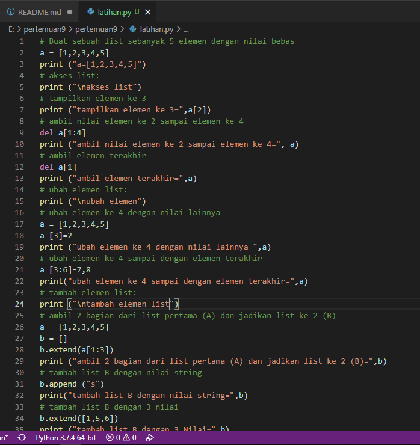
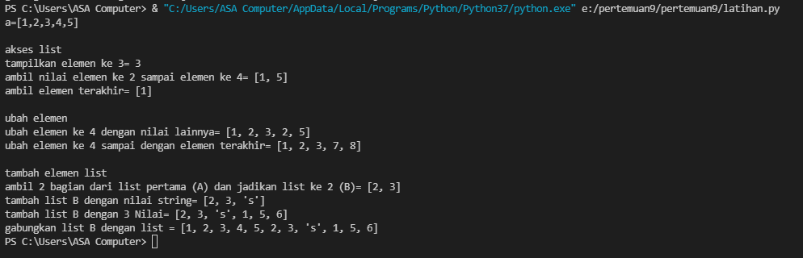
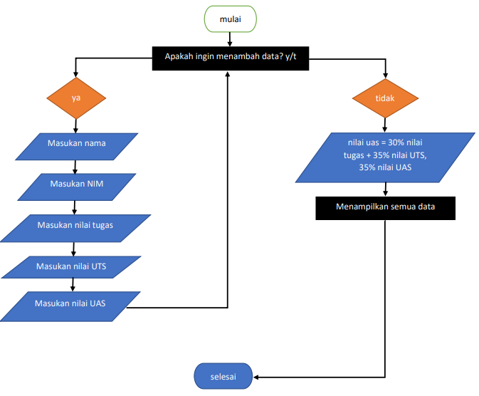
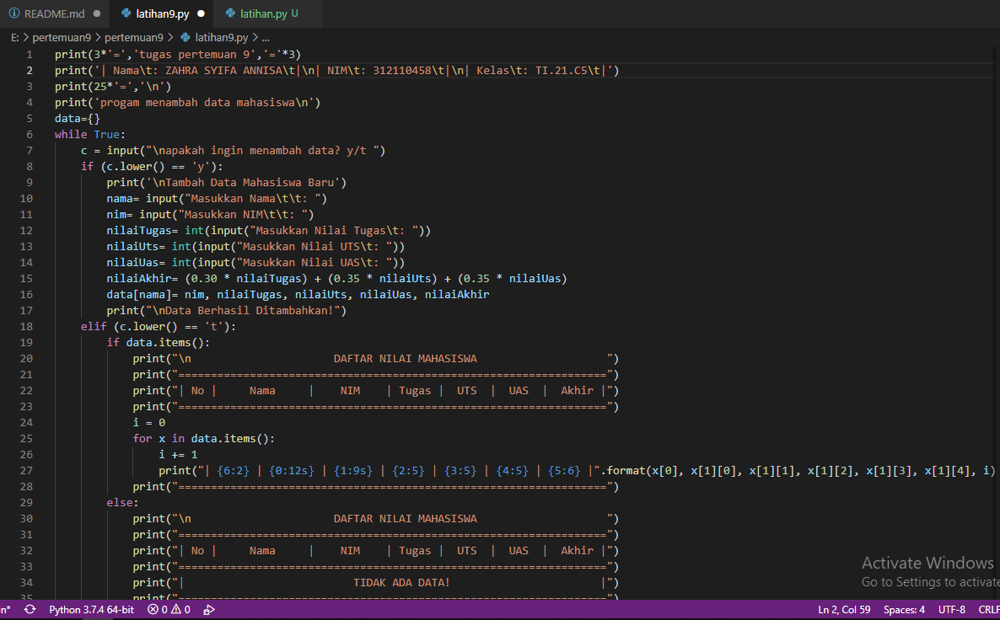
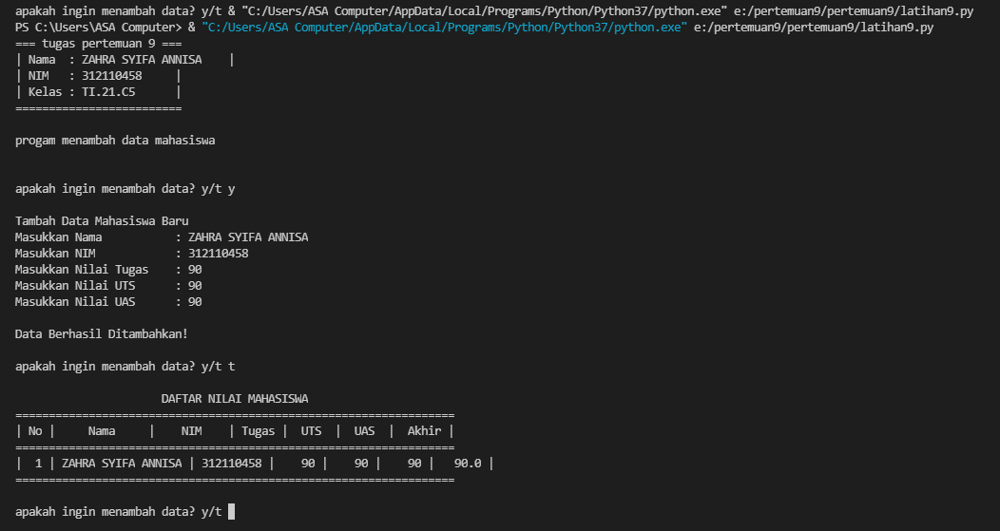

# pertemuan9
soal

jawab

pertama adalah membuat list dengan 5 elemen saya membuat list

```py
a = [1,2,3,4,5]
```
kedua pada akses list saya diberi 3 soalan

1. menampilkan elemen ke 3
2. ambil nilai elemen ke 2 sampai elemen ke 4
3. ambil elemen terakhir

dari soal diatas saya mengerjakan dengan cara sebagai berikut:

```py
1. a[2]
2. del a[1:4]
    print(a)
3. del a[1] 
    print(a)
```
ketiga pada ubah element list saya diberikan 2 soalan

1. ubah elemen ke 4 dengan nilai lainnya
2. ubah elemen ke 4 sampai dengan elemen terakhir

dari soalan diatas saya menjawab dengan cara sebagai berikut:

```py
a [3] = 2
print (a)
a [3:6] = 7, 8
print(a)
```
Terakhir pada tambah elemen list saya diberi soalan sebagai berikut

1. ambil 2 bagian dari list pertama (A) dan jadikan list ke 2 (B)
2. tambah list B dengan nilai string
3. tambah list B dengan 3 nilai
4. gabungkan list B dengan list A

dari soal diatas saya menjawab dengan cara sebagai berikut

```py
b = []
b.extend (a[1:3])
print(b)
b.append ('s')
print(b)
b.extend([1, 5, 6])
print(b)
c=a+b
print(c)
```
berikut ini adalah screenshot pada visual studio code



Output

Berikut output dari program diatas 



Tugas praktikum

soal


flowchart

pertama sebelum membuat program saya membuat flowchart terlebih dahulu
berikut flowchart yang telah dibuat



jawab

pertama saya membuat inputan dan looping agar program terus berjalan

```py
while true:
    c = input("apakah ingin menambah data? y/t ")
```

lalu saya membuat fungsi if apabila menginput 'y'

```py
if (c.lower() == 'y'):                                               
        print('\nTambah Data Mahasiswa Baru')
        nama= input("Masukkan Nama\t\t: ")                                        
        nim= input("Masukkan NIM\t\t: ")                                         
        nilaiTugas= int(input("Masukkan Nilai Tugas\t: "))                              
        nilaiUts= int(input("Masukkan Nilai UTS\t: "))                                   
        nilaiUas= int(input("Masukkan Nilai UAS\t: "))                                    
        nilaiAkhir= (0.30 * nilaiTugas) + (0.35 * nilaiUts) + (0.35 * nilaiUas)              
        data[nama]= nim, nilaiTugas, nilaiUts, nilaiUas, nilaiAkhir                         
        print("\nData Berhasil Ditambahkan!")
```

saya juga membuat percabangan if untuk apabila menginput 't'

```py
elif (c.lower() == 't'):                                                                    
        if data.items():                                                                     
            print("\n                      DAFTAR NILAI MAHASISWA                    ")
            print("==================================================================")
            print("| No |     Nama     |    NIM    | Tugas |  UTS  |  UAS  |  Akhir |")
            print("==================================================================")
            i = 0
            for x in data.items():
                i += 1
                print("| {6:2} | {0:12s} | {1:9s} | {2:5} | {3:5} | {4:5} | {5:6} |".format(x[0], x[1][0], x[1][1], x[1][2], x[1][3], x[1][4], i))  
            print("==================================================================")
        else:
            print("\n                      DAFTAR NILAI MAHASISWA                    ")
            print("==================================================================")
            print("| No |     Nama     |    NIM    | Tugas |  UTS  |  UAS  |  Akhir |")
            print("==================================================================")
            print("|                          TIDAK ADA DATA!                       |")
            print("==================================================================")
```

dan saya menambahan else untuk menyetop loopingan tadi

```py
else:
    break

```

dari program diatas berikut screenshot pada visual studio code:



output

dari program diatas saya mendapatkan output sebagai berikut

